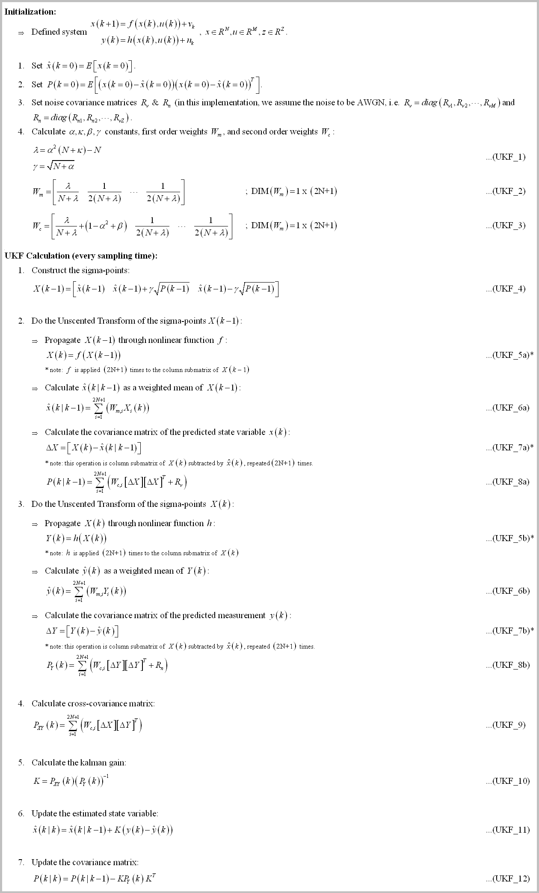

# Arduino_UKF_Library
This is a compact Unscented Kalman Filter (UKF) library for Teensy4.0/Arduino system (or real time embedded system in general).
- It's not using Eigen (small source code - more simple to understand).
- It's not using C++ Standard Library/std (for embedded consideration).
- If you set `SISTEM_IMPLEMENTASI` to `SISTEM_EMBEDDED_NO_PRINT` in `konfig.h`, the code is platform agnostic (not using any library beside these C header files: `stdlib.h`, `stdint.h`, and `math.h`).
- There's no malloc/new/free dynamic memory allocation for real time application (but using heavy stack local variables, so you need to run it through static memory analyzer if you are really concern about hard real time application).

# The Background
The Unscented Kalman Filter is designed to handle state variable estimation where the system is highly nonlinear that the EKF will do job poorly, or even fail to do (like for non-differentiable nonlinear system). Unfortunately, the algorithm is quite complex compared to Extended Kalman Flter. With that in mind, I made this library for any student who want to learn the structure of UKF, the computer code implementation of it, and how to use the filter for a nontrivial problem.

This library is made with specific goal for educational purpose (I've made decision to sacrifice speed to get best code readability I could get) while still capable of tackling real-time control system implementation (the code is computed in less than **300 us**! See *Some Benchmark* section below).

Without further ado, first some definition:

Many author blended the unscented transformation into kalman filter structure (even in the Jeffrey Uhlmann's original paper) to make it into a familiar KF structure. But in this implementation, I prefer to emphasize the unscented transformation structure in the hope you can get the big idea of the transformation. That make the implementation somewhat different from a typical UKF formulation, but in essence it's all the same. So the UKF algorithm can be descibed as:

# How to Use

# Some Benchmark

# Closing Remark

